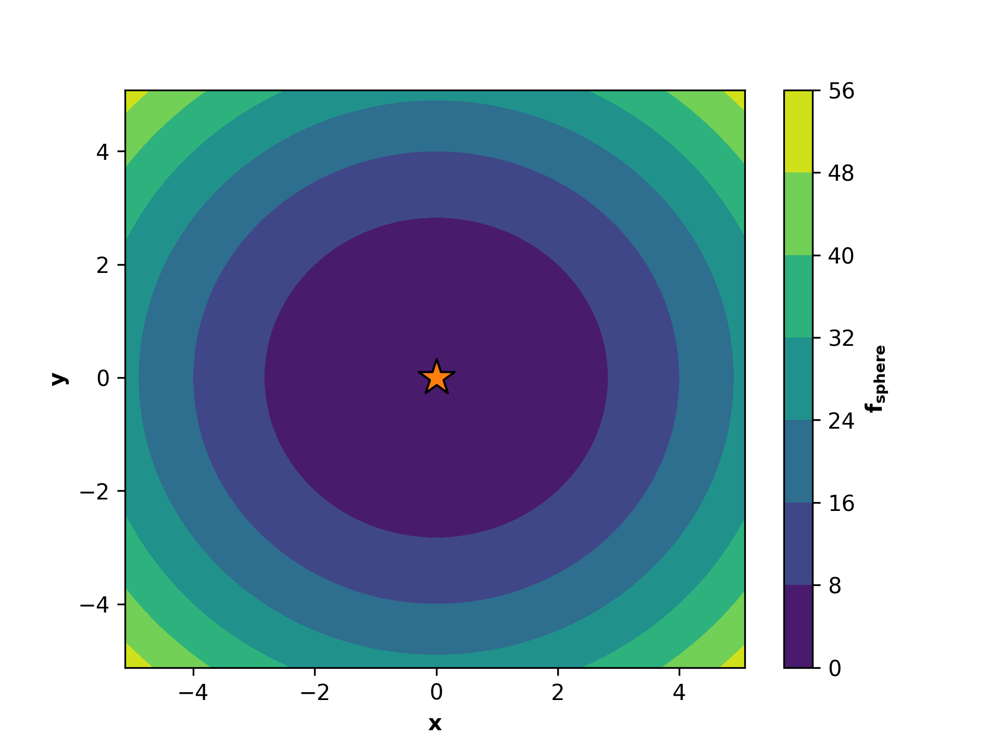

# Parallel Propagator of Populations

[](https://zenodo.org/badge/latestdoi/495731357)
[](https://fair-software.eu)
[](https://opensource.org/licenses/BSD-3-Clause)


[](https://github.com/astral-sh/ruff)[](https://www.python.org/downloads/)
[](https://www.bestpractices.dev/projects/7785)
[](mailto:propulate@lists.kit.edu)
[](https://propulate.readthedocs.io/en/latest/?badge=latest)
[](https://codecov.io/gh/Helmholtz-AI-Energy/propulate)[](https://results.pre-commit.ci/latest/github/Helmholtz-AI-Energy/propulate/main)

# **Click [here](https://www.scc.kit.edu/en/aboutus/16956.php) to watch our 3 min introduction video!**

## What `Propulate` can do for you

`Propulate` is an HPC-tailored software for solving optimization problems in parallel. It is openly accessible and easy
to use. Compared to a widely used competitor, `Propulate` is consistently faster - at least an order of magnitude for a
set of typical benchmarks - and in some cases even more accurate.

Inspired by biology, `Propulate` borrows mechanisms from biological evolution, such as selection, recombination, and
mutation. Evolution begins with a population of solution candidates, each with randomly initialized genes. It is an
iterative "survival of the fittest" process where the population at each iteration can be viewed as a generation. For
each generation, the fitness of each candidate in the population is evaluated. The genes of the fittest candidates are
incorporated in the next generation.

Like in nature, `Propulate` does not wait for all compute units to finish the evaluation of the current generation.
Instead, the compute units communicate the currently available information and use that to breed the next candidate
immediately. This avoids waiting idly for other units and thus a load imbalance.
Each unit is responsible for evaluating a single candidate. The result is a fitness level corresponding with that
candidate’s genes, allowing us to compare and rank all candidates. This information is sent to other compute units as
soon as it becomes available.
When a unit is finished evaluating a candidate and communicating the resulting fitness, it breeds the candidate for the
next generation using the fitness values of all candidates it evaluated and received from other units so far.

`Propulate` can be used for hyperparameter optimization and neural architecture search at scale.
It was already successfully applied in several accepted scientific publications. Applications include grid load
forecasting, remote sensing, and structural molecular biology:

>
> A. Weyrauch, T. Steens, O. Taubert, et al. **ReCycle: Fast and Efficient Long Time Series Forecasting with Residual
> Cyclic Transformers**. arXiv preprint (2024). https://doi.org/10.48550/arXiv.2405.03429

> O. Taubert, F. von der Lehr, A. Bazarova, et al. **RNA contact prediction by data efficient deep learning**. Commun
> Biol 6, 913 (2023). https://doi.org/10.1038/s42003-023-05244-9

> D. Coquelin, K. Flügel, M. Weiel, et al. **Harnessing Orthogonality to Train Low-Rank Neural Networks**. arXiv
> preprint (2023). https://doi.org/10.48550/arXiv.2401.08505

> Y. Funk, M. Götz, & H. Anzt. **Prediction of optimal solvers for sparse linear systems using deep learning**.
> Proceedings of the 2022 SIAM Conference on Parallel Processing for Scientific Computing (pp. 14-24). Society for
> Industrial and Applied Mathematics (2022). https://doi.org/10.1137/1.9781611977141.2

> D. Coquelin, R. Sedona, M. Riedel, and M. Götz. **Evolutionary Optimization of Neural Architectures in Remote Sensing
> Classification Problems**. IEEE International Geoscience and Remote Sensing Symposium IGARSS, Brussels, Belgium,
> pp. 1587-1590 (2021). https://doi.org/10.1109/IGARSS47720.2021.9554309

## In more technical terms

``Propulate`` is a massively parallel evolutionary hyperparameter optimizer based on the island model with asynchronous
propagation of populations and asynchronous migration.
In contrast to classical GAs, ``Propulate`` maintains a continuous population of already evaluated individuals with a
softened notion of the typically strictly separated, discrete generations.
Our contributions include:
- A novel parallel genetic algorithm based on a fully asynchronized island model with independently processing workers.
- Massive parallelism by asynchronous propagation of continuous populations and migration via efficient communication using the message passing interface.
- Optimized use efficiency of parallel hardware by minimizing idle times in distributed computing environments.

To be more efficient, the generations are less well separated than they usually are in evolutionary algorithms.
New individuals are generated from a pool of currently active, already evaluated individuals that may be from any
generation.
Individuals may be removed from the breeding population based on different criteria.

You can find the corresponding publication [here](https://doi.org/10.1007/978-3-031-32041-5_6):
> Taubert, O. *et al.* (2023). Massively Parallel Genetic Optimization Through Asynchronous Propagation of Populations.
> In: Bhatele, A., Hammond, J., Baboulin, M., Kruse, C. (eds) High Performance Computing. ISC High Performance 2023.
> Lecture Notes in Computer Science, vol 13948. Springer, Cham.
> [doi.org/10.1007/978-3-031-32041-5_6](https://doi.org/10.1007/978-3-031-32041-5_6)

## Documentation

Check out the full documentation at [https://propulate.readthedocs.io/](https://propulate.readthedocs.io/) :rocket:! Here you can find installation
instructions, tutorials, theoretical background, and API references.

**:point_right: If you have any questions or run into any challenges while using `Propulate`, don't hesitate to post an
[issue](https://github.com/Helmholtz-AI-Energy/propulate/issues) :bookmark:, reach out via [GitHub
discussions](https://github.com/Helmholtz-AI-Energy/propulate/discussions) :octocat:, or contact us directly via e-mail
:email: to [propulate@lists.kit.edu](mailto:propulate@lists.kit.edu).**

## Installation

- You can install the **latest stable release** from PyPI: ``pip install propulate``
- If you need the **latest updates**, you can also install ``Propulate`` directly from the master branch.
Pull and run ``pip install .``.
- If you want to run the **tutorials**, you can install the required dependencies via: ``pip install ."[tutorials]"``
- If you want to **contribute** to ``Propulate`` as a developer, you need to install the required dependencies with the package:
``pip install -e ."[dev]"``.

``Propulate`` depends on [``mpi4py``](https://mpi4py.readthedocs.io/en/stable/) and requires an MPI implementation under
the hood. Currently, it is only tested with [OpenMPI](https://www.open-mpi.org/).

## Quickstart
*Below, you can find a quick recipe for how to use `Propulate` in general. Check out the official
[ReadTheDocs](https://propulate.readthedocs.io/en/latest/tut_propulator.html) documentation for more detailed tutorials
and explanations.*

Let's minimize the sphere function $f_\text{sphere}\left(x,y\right)=x^2 +y^2$ with `Propulate` as a quick example. The
minimum is at $\left(x, y\right)=\left(0,0\right)$ at the orange star.

First, we need to define the key ingredients that define our optimization problem:
- The **search space** of the parameters to be optimized as a `Python` dictionary. `Propulate` can handle three different
  parameter types:
    - A tuple of `float` for a continuous parameter, e.g., `{"learning_rate": (0.0001, 0.01)}`
    - A tuple of `int` for an ordinal parameter, e.g., `{"conv_layers": (2, 10)}`
    - A tuple of `str` for a categorical parameter, e.g., `{"activation": ("relu", "sigmoid", "tanh")}`

  Thus, an exemplary search space might look like this:
  ```python
  search_space = {
      "learning_rate": (0.0001, 0.01),  # Search a continuous space between 0.0001 and 0.01.
      "num_layers": (2, 10),  # Search the integer space between 2 and 10 (inclusive).
      "activation": ("relu", "sigmoid", "tanh"),  # Search the categorical space with the specified possibilities.
  }
  ```

  The sphere function has two continuous parameters, $x$ and $y$, and we consider $x,y\in\left[-5.12,5.12\right]$. The
  search space in our example thus looks like this:
  ```python
  limits = {
      "x": (-5.12, 5.12),
      "y": (-5.12, 5.12)
  }
  ```
- The **loss function**. This is the function we want to minimize in order to find the best parameters. It can be any
  `Python` function that
  - takes a set of parameters as a `Python` dictionary as an input.
  - returns a scalar loss value that determines how good the tested parameter set is.

  In this example, the loss function whose minimum we want to find is the sphere function:
  ```python
  def sphere(params: Dict[str, float]) -> float:
    """
    Sphere function: continuous, convex, separable, differentiable, unimodal

    Input domain: -5.12 <= x, y <= 5.12
    Global minimum 0 at (x, y) = (0, 0)

    Parameters
    ----------
    params: Dict[str, float]
        The function parameters.

    Returns
    -------
    float
        The function value.
    """
    return numpy.sum(numpy.array(list(params.values())) ** 2).item()
  ```
Next, we need to define the **evolutionary operator** or propagator that we want to use to breed new individuals during the
optimization process. `Propulate` provides a reasonable default propagator via a utility function:
```python
# Set up logger for Propulate optimization.
propulate.set_logger_config()
# Set up separate random number generator for Propulate optimization. DO NOT USE SOMEWHERE ELSE!
rng = random.Random(
    <your-random-seed> + mpi4py.MPI.COMM_WORLD.rank
)
# Set up evolutionary operator.
propagator = propulate.get_default_propagator(
    pop_size=config.pop_size,  # The breeding population size
    limits=limits,  # The search-space limits
    rng=rng,  # Random number generator
)
```
We also need to set up the asynchronous parallel evolutionary **optimizer**, that is a so-called ``Propulator`` instance:
```python
# Set up Propulator performing actual optimization.
propulator = propulate.Propulator(
    loss_fn=sphere,
    propagator=propagator,
    rng=rng,
    generations=config.generations,
    checkpoint_path=config.checkpoint,
)
```
Now we can run the actual optimization. Overall, ``generations * mpi4py.MPI.COMM_WORLD.size`` evaluations will be
performed:
```python
# Run optimization and print summary of results.
propulator.propulate()
propulator.summarize()
```
The output should look something like this:
```text
#################################################
# PROPULATE: Parallel Propagator of Populations #
#################################################

[2024-03-12 14:37:01,374][propulate.propulator][INFO] - No valid checkpoint file given. Initializing population randomly...
[2024-03-12 14:37:01,374][propulate.propulator][INFO] - Island 0 has 4 workers.
[2024-03-12 14:37:01,374][propulate.propulator][INFO] - Island 0 Worker 0: In generation 0...
[2024-03-12 14:37:01,374][propulate.propulator][INFO] - Island 0 Worker 3: In generation 0...
[2024-03-12 14:37:01,374][propulate.propulator][INFO] - Island 0 Worker 2: In generation 0...
[2024-03-12 14:37:01,374][propulate.propulator][INFO] - Island 0 Worker 1: In generation 0...
[2024-03-12 14:37:01,377][propulate.propulator][INFO] - Island 0 Worker 3: In generation 10...
[2024-03-12 14:37:01,377][propulate.propulator][INFO] - Island 0 Worker 1: In generation 10...
[2024-03-12 14:37:01,378][propulate.propulator][INFO] - Island 0 Worker 0: In generation 10...
[2024-03-12 14:37:01,378][propulate.propulator][INFO] - Island 0 Worker 2: In generation 10...

...
[2024-03-12 14:37:02,197][propulate.propulator][INFO] - Island 0 Worker 1: In generation 960...
[2024-03-12 14:37:02,206][propulate.propulator][INFO] - Island 0 Worker 2: In generation 990...
[2024-03-12 14:37:02,206][propulate.propulator][INFO] - Island 0 Worker 1: In generation 970...
[2024-03-12 14:37:02,215][propulate.propulator][INFO] - Island 0 Worker 1: In generation 980...
[2024-03-12 14:37:02,224][propulate.propulator][INFO] - Island 0 Worker 1: In generation 990...
[2024-03-12 14:37:02,232][propulate.propulator][INFO] - OPTIMIZATION DONE.
NEXT: Final checks for incoming messages...
[2024-03-12 14:37:02,244][propulate.propulator][INFO] - ###########
# SUMMARY #
###########
Number of currently active individuals is 4000.
Expected overall number of evaluations is 4000.
[2024-03-12 14:37:03,703][propulate.propulator][INFO] - Top 1 result(s) on island 0:
(1): [{'a': '2.91E-3', 'b': '-3.05E-3'}, loss 1.78E-5, island 0, worker 0, generation 956]
```
### Let's get your hands dirty
Do the following to run the [example script](https://github.com/Helmholtz-AI-Energy/propulate/blob/master/tutorials/propulator_example.py):

- Make sure you have a working MPI installation on your machine.
- If you have not already done this, create a fresh virtual environment with ``Python``: ``$ python3 -m venv best-venv-ever``
- Activate it: ``$ source best-venv-ever/bin/activate``
- Upgrade ``pip``: ``$ pip install --upgrade pip``
- Install ``Propulate``: ``$ pip install propulate``
- Run the example script ``propulator_example.py``: ``$ mpirun --use-hwthread-cpus python propulator_example.py``

## Acknowledgments
*This work is supported by the Helmholtz AI platform grant.*

