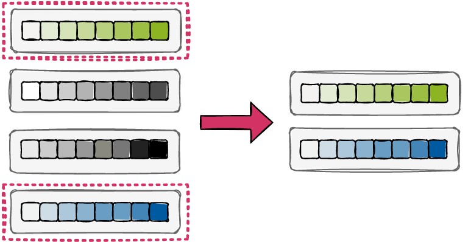
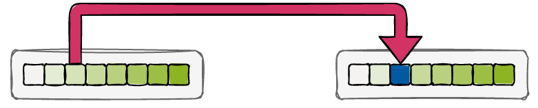

.. _eas::

Evolutionary Algorithms
=======================
|

|

**WHAT?**
    "Survival of the fittest" metaheuristics inspired by biological evolution

**WHY?**
    Find good-enough solutions to global optimization problems efficiently.

**HOW?**

    Individuals
        Representation of candidate solutions in the search space. This is the vector of parameters to be optimized.
    Fitness function
        Scalar metric to evaluate how good an individual is. This is the metric to optimize on.
    Evolutionary operators
        Mechanisms for breeding new (hopefully better) individuals from current ones.
        The basic mechanism of EAs is that of Darwinian evolution, i.e., beneficial traits are selected, recombined,
        and mutated to breed more fit individuals. This is what we do to the current population of individuals to get
        the next generation to be evaluated.

.. figure:: images/ea_jargon.png
   :width: 52 %
   :align: center

|

Evolutionary Operators
----------------------

We use evolutionary operators to generate new individuals from current ones.
The three types of evolutionary operators are selection, crossover or recombination, and mutation.
By repetitively applying a stochastic combination of these operators, the population's average fitness is improved over the course
of the optimization. Many different variants exist.
The basic mechanisms are illustrated below:

Selection
    Select individuals from the current generation for breeding, usually somehow based on their fitness.

|

Crossover
    Generate new child individuals from selected parent individuals by recombining the latters' genes.

.. image:: images/crossover.png
   :width: 100 %
   :align: center

|

Mutation
    Randomly change an individual's genes to promote genetic diversity.

|