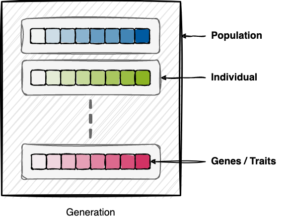

.. easexplained:

Evolutionary Algorithms Explained
=================================
|

|

**WHAT?**
    "Survival of the fittest" metaheuristics inspired by biological evolution

**WHY?**
    Find good-enough solutions to global optimization problems efficiently.

**HOW?**

    Individuals
        Representation of candidate solutions in the search space. This is the vector of parameters to be optimized.
    Fitness function
        Scalar metric to evaluate how good an individual is. This is the metric to optimize on.
    Evolutionary operators
        Mechanisms for breeding new (hopefully better) individuals from current ones.
        The basic mechanism of EAs is that of Darwinian evolution, i.e., beneficial traits are selected, recombined,
        and mutated to breed more fit individuals. This is what we do to the current population of individuals to get
        the next generation to be evaluated.

|

How evolutionary algorithms work
--------------------------------

|

Evolutionary operators
----------------------

We use evolutionary operators to generate new individuals from current ones.
The three types of evolutionary operators are selection, crossover or recombination, and mutation.
By repetitively applying a stochastic combination of these operators, the population's average fitness is improved over the course
of the optimization. Many different variants exist.
The basic mechanisms are illustrated below:

Selection
    Select individuals from the current generation for breeding, usually somehow based on their fitness.

.. image:: images/selection.png
   :width: 72 %
   :align: center

|

Crossover
    Generate new child individuals from selected parent individuals by recombining the latters' genes.

.. image:: images/crossover.png
   :width: 100 %
   :align: center

|

Mutation
    Randomly change an individual's genes to promote genetic diversity.

.. image:: images/mutation.png
   :width: 72 %
   :align: center

|

Let's go parallel
-----------------

|

Since all individuals in each generation are independent, they can be evaluated in parallel.

The problem with synchronous parallel evaluation
^^^^^^^^^^^^^^^^^^^^^^^^^^^^^^^^^^^^^^^^^^^^^^^^
Typically, all evaluations of the current generation have to be completed before the next one is bred synchronously
from the discrete population of the last generation. This is what is known as a *synchronous* parallel EA.
The parallelization structure of synchronous EAs introduces explicit synchronization points at every discrete generation
update of the population. Different evaluation times of different individuals thus lead to idle times of the faster
processors. This hinders optimal resource utilization and affects the scalability by introducing a substantial bottleneck.

.. image:: images/synchronous_EA.png
   :width: 60 %
   :align: center

|

The solution in Propulate: Asynchronous parallel evaluation
^^^^^^^^^^^^^^^^^^^^^^^^^^^^^^^^^^^^^^^^^^^^^^^^^^^^^^^^^^^
To alleviate the bottleneck inherent to synchronous parallel EAs, we introduce ``Propulate``, a massively parallel
evolutionary optimizer with *asynchronous* propagation of populations.
Unlike classical EAs, ``Propulate`` maintains a continuous population of all evaluated individuals so far with a
softened notion of the typically strictly separated, discrete generations.
This enables asynchronous evaluation, variation, propagation, and migration of individuals with maximum computational
efficiency.

.. image:: images/asynchronous_EA.png
   :width: 50 %
   :align: center

|
