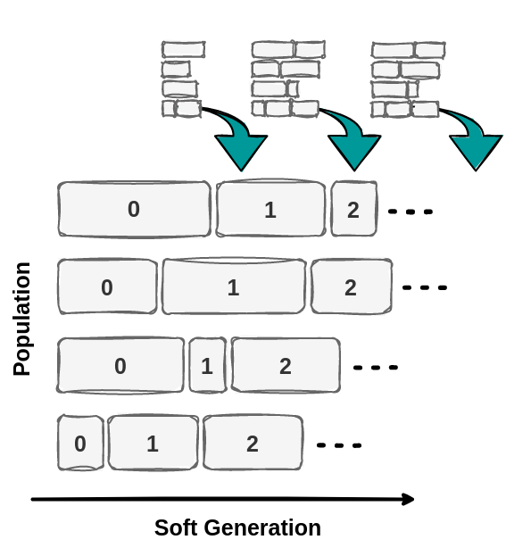

.. propulate documentation master file, created by
   sphinx-quickstart on Fri Jul 21 10:51:52 2023.
   You can adapt this file completely to your liking, but it should at least
   contain the root `toctree` directive.

|

`Click`_ to watch our 3 min introduction video!

|

`Click`_ to watch our 3 min introduction video!

What Propulate can do for you
===============================
``Propulate`` is an HPC-tailored software for solving optimization problems in parallel.
More specifically, it is an asynchronous evolutionary optimization algorithm and ``Python`` package with MPI parallelization.
This makes it particularly suitable for large-scale hyperparameter optimization and neural architecture search.

.. note::
   This project is under active development. For any issues, features requests, or if you would like to contribute, our `Github page`_ page is the place to go.

Inspired by biology, ``Propulate`` borrows mechanisms from biological evolution, such as selection, recombination, and mutation.
Evolution begins with a population of solution candidates, each with randomly initialized genes.
It is an iterative "survival of the fittest" process where the population at each iteration can be viewed as a generation.
For each generation, the fitness of each candidate in the population is evaluated.
The genes of the fittest candidates are incorporated in the next generation.

.. figure:: images/ea_pop.png
   :width: 100 %
   :align: center

   Functional principle of evolutionary algorithms: ``Propulate``'s basic mechanism is that of Darwinian evolution,
   i.e., beneficial traits are selected, recombined, and mutated to breed more fit individuals

Like in nature, ``Propulate`` does not wait for all compute units to finish the evaluation of the current generation.
Instead, the compute units communicate the currently available information and use that to breed the next candidate immediately.
This avoids waiting idly for other units and thus a load imbalance.
Each unit is responsible for evaluating a single candidate.
The result is a fitness level corresponding with that candidate’s genes, allowing us to compare and rank all candidates.
This information is sent to other compute units as soon as it becomes available.
When a unit is finished evaluating a candidate and communicating the resulting fitness, it breeds the candidate for the next
generation using the fitness values of all candidates it evaluated and received from other units so far.

In more technical terms
=======================
``Propulate`` is a massively parallel evolutionary optimizer based on the island model with asynchronous propagation of
populations and asynchronous migration. In contrast to classical genetic algorithms, ``Propulate`` maintains a continuous
population of already evaluated individuals with a softened notion of the typically strictly separated, discrete generations.
Our contributions include:

- A novel parallel genetic algorithm based on a fully asynchronous island model with independently processing workers.
- Massive parallelism by asynchronous propagation of continuous populations and migration via efficient communication using the message passing interface.
- Optimized use efficiency of parallel hardware by minimizing idle times in distributed computing environments.

.. figure:: images/synchronous_EA.png
   :width: 50 %
   :align: center

   The parallelization structure of synchronous evolutionary algorithms introduces explicit synchronization points at
   every discrete generation update of the population. Different evaluation times of different individuals thus lead to idle
   times of the faster processors. This hinders optimal resource utilization.

   To alleviate the bottleneck inherent to synchronous parallel evolutionary algorithms,
   ``Propulate`` implements a fully asynchronous island model specifically designed
   for large-scale HPC systems. Unlike conventional GAs, Propulate maintains a continuous population of evaluated
   individuals with a softened notion of the typically strictly separated generations.
   This enables asynchronous evaluation, variation, propagation, and migration of individuals with maximum computational
   efficiency.

To be more efficient, the generations are less well separated than they usually are in evolutionary algorithms.
New individuals are generated from a pool of currently active, already evaluated individuals that may be from any generation.
Individuals may be removed from the breeding population based on different criteria.

You can find the corresponding publication `here`_:

   *Taubert, O. et al. (2023). Massively Parallel Genetic Optimization Through Asynchronous Propagation of Populations. In: Bhatele, A., Hammond, J., Baboulin, M., Kruse, C. (eds) High Performance Computing. ISC High Performance 2023. Lecture Notes in Computer Science, vol 13948. Springer, Cham. doi.org/10.1007/978-3-031-32041-5_6*

``Propulate`` is also listed in the `Helmholtz Research Software Directory`_.

.. toctree::
   :maxdepth: 1
   :caption: Contents:

   quickstart
   install
   usage
   easexplained

.. Links
.. _Click: https://www.scc.kit.edu/en/aboutus/16956.php
.. _here: https://doi.org/10.1007/978-3-031-32041-5_6
.. _Github page: https://github.com/Helmholtz-AI-Energy/propulate
.. _Helmholtz Research Software Directory: https://helmholtz.software/software/propulate
