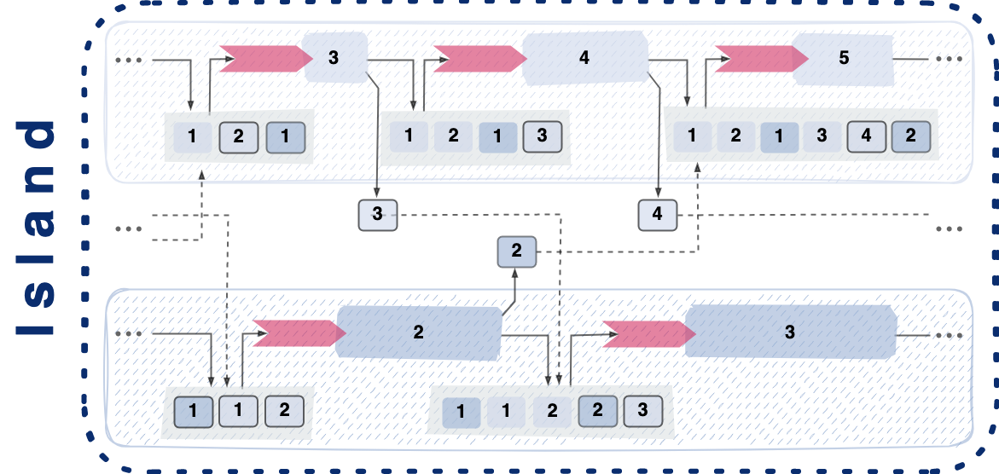
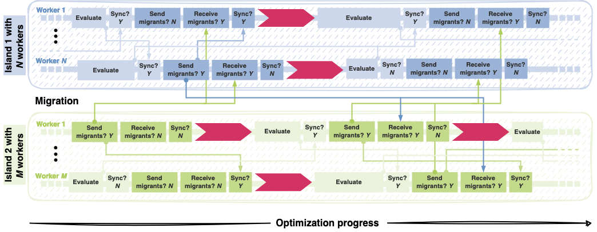

.. _island_model::

The Island Model
================

On top of its basic asynchronous population-based optimizer, ``Propulate`` implements an *asynchronous island model* |:island:|.
The island model is a common parallelization scheme for evolutionary algorithms. It combines independent evolution of
self-contained subpopulations (or islands) with intermittent exchange of selected individuals (migration).
To coordinate the search globally, each  island occasionally delegates migrants to be included in the target islands'
populations. With worse performing islands typically receiving candidates from better performing ones, islands
communicate genetic information competitively, thus increasing diversity among the subpopulations.

What this basically means is, that we do not only consider one population of individuals but multiple independent
populations. We call each of these populations an island. Those islands co-exist peacefully most of the time. But from
time to time, individuals migrate from one island to another. In this way, we can explore the
search space more comprehensively and prevent local trapping.

|im|  |im|

|

Propulate - Asynchronous Migration Between Islands
--------------------------------------------------
To get the most out of HPC resources ``Propulate`` employs a fully asynchronous island model without explicit synchronization
points. The functional principle is similar to the asynchronous propagation of populations in ``Propulate``'s core.
To explain how asynchronous migration works exactly, let us consider two islands with :math:`N` (blue) and :math:`M`
(green) workers, respectively. We illustrate migration (dark colors) by tracing worker :math:`\small N` on island 1.
After evaluation and mutual intra-island updates (light blue), this worker performs migration: It sends the chosen
migrants to all workers of each target island, here island 2. For proper accounting of the populations, it informs all
workers on its own island about the emigrated individuals (middle blue arrow). The target island's workers receive the
migrants asynchronously (dark blue arrows). Afterwards, worker :math:`\small N` receives incoming migrants from island 2
to be included into its population. It then probes for individuals that have been emigrated by other workers on its
island, here worker 1, in the meantime and need to be deactivated. After these migration-related intra-island population
updates, it breeds the next generation. As migration does not occur in this generation, it directly receives migrants
from island 2.

|