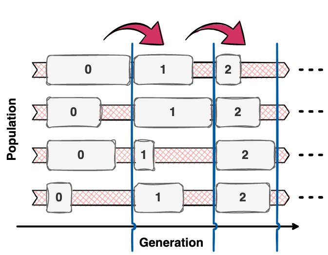
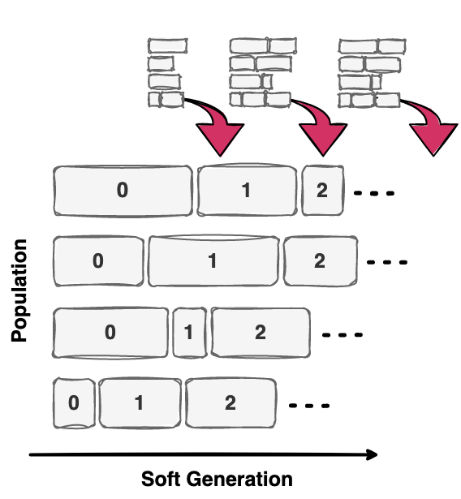

.. _parallel_pop::

Let's Go Parallel
=================

|

Since the individuals in each generation of a population-based algorithm are typically independent, they can be
evaluated in parallel.

Why Synchronous Parallel Evaluation Sucks
-----------------------------------------
Typically, all evaluations of the current generation have to be completed before the next one is bred synchronously from
the discrete population of the last generation. This is what is known as a *synchronous* parallel algorithm. This
parallelization structure introduces explicit synchronization points at every discrete generation update of the
population. Different evaluation times of different individuals thus lead to idle times of the faster processors. This
hinders optimal resource utilization and affects the scalability by introducing a substantial bottleneck.

|

Propulate: Asynchronous Parallel Evaluation
-------------------------------------------
To alleviate the bottleneck inherent to synchronous parallel algorithms, we introduce ``Propulate``, a massively
parallel evolutionary optimizer with *asynchronous* propagation of populations. Unlike classical parallel
population-based algorithms, ``Propulate`` maintains a continuous population of all evaluated individuals so far with a
softened notion of the typically strictly separated, discrete generations. This enables asynchronous evaluation,
variation, propagation, and migration of individuals with maximum computational efficiency.

|

Asynchronous Propagation of Populations
---------------------------------------
How this exactly works is shown in the figure below, depicting the interaction of two workers. Individuals
bred by worker 1 and 2 are shown in light and dark blue, respectively. Their generations are given by a subscript.
Populations are depicted as grey boxes, where most recent individuals have black outlines. Varying evaluation times are
represented by sharp boxes of different widths. We illustrate the asynchronous propagation and intra-island
synchronization of the population using the example of the light blue individual  :math:`\small\mathrm{ind}_{g3}`. This
individual is bred by worker 1 in generation 3 by applying the propagator (red) to the worker's current population.
After evaluating :math:`\small\mathrm{ind}_{g3}`, worker 1 sends it to all workers on its island and appends it to its
population. As no evaluated individuals dispatched by worker 2 await to be received, worker 1 proceeds with breeding.
Worker 2 receives light the blue :math:`\small\mathrm{ind}_{g3}` only after finishing the evaluation of the dark blue
:math:`\small\mathrm{ind}_{g2}`. It then appends both to its population and breeds a new individual for generation 3.

|