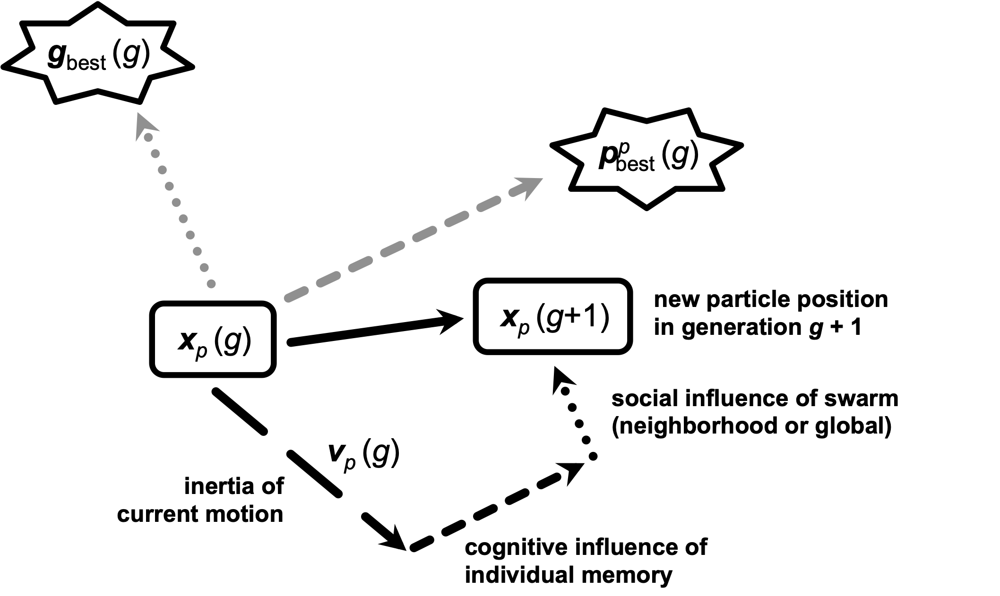

.. _pso:

Particle Swarm Optimization
===========================

Particle swarm optimization (PSO) is inspired by the social behavior of birds flocking or fish schooling. It was
developed by James Kennedy and Russell Eberhart in 1995 [1] and is used to find approximate solutions to complex
optimization problems. It solves problems by having a population (swarm) of candidate solutions (particles) move around
in the search space according to simple mathematical formulae over the particle's position and velocity. Each particle's
movement is influenced by its local best-known position but is also guided towards the best-known positions in the
search space, which are updated as better positions are found by other particles. Altogether, this is assumed to move
the swarm towards the best parameter combinations.

[1] *J. Kennedy and R. Eberhart, "Particle swarm optimization", Proceedings of ICNN'95 - International Conference on
Neural Networks, Perth, WA, Australia, 1995, pp. 1942-1948 vol.4,* https://doi.org/10.1109/ICNN.1995.488968

|

Basic Concepts
--------------
- **Particles and Swarm:** PSO considers a swarm of particles, where each particle represents a potential solution to
  the optimization problem.
- **Position and Velocity:** Each particle has a position and a velocity. The position represents the current solution,
  and the velocity determines the direction and speed of the particle's movement in the search space.

Key Components
--------------
**1. Initialization**

- Particles are initialized with random positions and velocities within the search space.
- Each particle's position is evaluated using an objective function, which measures the quality of the solution.

**2. Movement**

- Particles move through the search space by updating their positions and velocities.
- The velocity update is influenced by two main factors:

  - **Personal best**: The best position a particle has encountered.
  - **Global best**: The best position found by any particle in the swarm.

- The velocity update equation typically looks like this:

  .. math::

     v_p(g+1) = w \cdot v_i(g) + c_1 \cdot r_1 \cdot (p_\text{best}^p(g) - x_p(g)) + c_2 \cdot r_2 \cdot (g_\text{best}(g) - x_p(g))

  where:

    - :math:`p_\text{best}(g)` is the personal best of particle :math:`p` in generation :math:`g`.
    - :math:`g_\text{best}(g)` is the swarm's global best.
    - :math:`v_p(g)` is the current velocity of particle :math:`p`.
    - :math:`x_p(g)` is the current position of particle :math:`p`.
    - :math:`w` is the inertia weight that controls the impact of the previous velocity.
    - :math:`c_1` and :math:`c_2` are cognitive and social coefficients, respectively.
    - :math:`r_1` and :math:`r_2` are random numbers between 0 and 1.

   **The particle update rule visually explained.**

**3. Position Update**

- After updating the velocity, the new position of each particle is calculated as follows:

.. math::

   x_p(g+1) = x_p(g) + v_p(g+1)

**4. Evaluation**

- Each particle's new position is evaluated using the fitness function.
- The personal best :math:`p_\text{best}` and global best :math:`g_\text{best}` are updated if the new position offers a
  better solution.

Iteration
---------
The process of updating velocities, positions, and evaluating the fitness function continues iteratively until a
stopping criterion is met, such as a maximum number of iterations or a satisfactory fitness level.

Advantages
----------
- PSO is simple to implement and computationally efficient.
- It requires few parameters to adjust compared to other optimization algorithms.
- It can handle non-linear, non-differentiable, and multi-modal optimization problems effectively.
