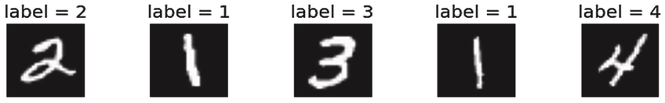

.. _tut_hpo:

Hyperparameter optimization of a neural network
===============================================
You can find the corresponding ``Python`` script here:
https://github.com/Helmholtz-AI-Energy/propulate/blob/master/scripts/torch_example.py

Almost all machine-learning algorithms have non-learnable hyperparameters that influence the training and in
particular their predictive capacity.
``Propulate`` is intended to help AI practitioners optimizing those hyperparameters efficiently. Below, we show you how
to do this using a simple toy example. We want to train a simple convolutional neural network in ``Pytorch`` and
``Pytorch-Lightning`` for MNIST classification and we want to know the best hyperparameters in terms of prediction
accuracy of our network for this.

We consider:

* the number of convolutional layers ``conv_layers``
* the activation function to use ``activation``
* the learning rate ``learning_rate``

Thus, our search space dictionary looks as follows:

.. code-block:: python

    limits = {
        "conv_layers": (2, 10),  # number of convolutional layers, int for ordinal
        "activation": ("relu", "sigmoid", "tanh"),  # activation function to use, str for categorical
        "learning_rate": (0.01, 0.0001)}  # learning rate, float for continuous

When tuning the hyperparameters of an ML model, evaluating an individual during the optimization corresponds to training
a neural network instance using a specific combination of hyperparameters to be optimized. In addition, we need some
model performance metric to assign each evaluated individual, i.e., tested hyperparameter combination, a scalar loss.
Here, we choose the model's (negative) validation accuracy for this. Remember that the ``Propulate`` loss function takes
in a combination of those parameters that we want to optimize and returns a scalar value telling us how good this
parameter combination actually was. For hyperparameter optimization, the loss function thus takes in a hyperparameter
combination of our model, trains the model using this specific hyperparameter combination, and returns its validation
accuracy as a loss for the evolutionary optimization.
Below, we show you how to do this using the example of the most important code snippets. We start with defining the
neural network which looks like this:

.. code-block:: python

    class Net(LightningModule):
        """Neural network class."""
        def __init__(
                self,
                conv_layers: int,
                activation: torch.nn.modules.activation,
                lr: float,
                loss_fn: torch.nn.modules.loss
        ) -> None:
            """
            Set up neural network.

            Parameters
            ----------
            conv_layers: int
                         number of convolutional layers
            activation: torch.nn.modules.activation
                        activation function to use
            lr: float
                learning rate
            loss_fn: torch.nn.modules.loss
                     loss function
            """
            super(Net, self).__init__()

            self.lr = lr  # Set learning rate
            self.loss_fn = loss_fn  # Set loss function for neural network training.
            self.best_accuracy = 0.0  # Initialize the model's best validation accuracy.
            layers = []  # Set up the model architecture (depending on number of convolutional layers specified).
            layers += [nn.Sequential(nn.Conv2d(in_channels=1, out_channels=10, kernel_size=3, padding=1),
                                     activation()),]
            layers += [nn.Sequential(nn.Conv2d(in_channels=10, out_channels=10, kernel_size=3, padding=1),
                                     activation())
                       for _ in range(conv_layers - 1)]

            self.fc = nn.Linear(in_features=7840,
                                out_features=10)  # MNIST has 10 classes.
            self.conv_layers = nn.Sequential(*layers)
            self.val_acc = Accuracy("multiclass", num_classes=10)

        def forward(self, x: torch.Tensor) -> torch.Tensor:
            """
            Forward pass.

            Parameters
            ----------
            x: torch.Tensor
               data sample

            Returns
            -------
            torch.Tensor
                The model's predictions for input data sample
            """
            ...
            return x

        def training_step(
                self,
                batch: Tuple[torch.Tensor, torch.Tensor],
                batch_idx: int
        ) -> torch.Tensor:
            """
            Calculate loss for training step in Lightning train loop.

            Parameters
            ----------
            batch: Tuple[torch.Tensor, torch.Tensor]
                   input batch
            batch_idx: int
                       batch index

            Returns
            -------
            torch.Tensor
                training loss for input batch
            """
            x, y = batch
            return self.loss_fn(self(x), y)

        def validation_step(
                self,
                batch: Tuple[torch.Tensor, torch.Tensor],
                batch_idx: int
        ) -> torch.Tensor:
            """
            Calculate loss for validation step in Lightning validation loop during training.

            Parameters
            ----------
            batch: Tuple[torch.Tensor, torch.Tensor]
                   current batch
            batch_idx: int
                       batch index

            Returns
            -------
            torch.Tensor
                validation loss for input batch
            """
            x, y = batch
            pred = self(x)
            loss = self.loss_fn(pred, y)
            val_acc = self.val_acc(torch.nn.functional.softmax(pred, dim=-1), y)
            if val_acc > self.best_accuracy:  # This is the metric Propulate optimizes on!
                self.best_accuracy = val_acc
            return loss

        def configure_optimizers(self) -> torch.optim.sgd.SGD:
            """
            Configure optimizer.

            Returns
            -------
            torch.optim.sgd.SGD
                stochastic gradient descent optimizer
            """
            # The optimizer uses the learning rate which is one of the hyperparameters that we want to optimize.
            return torch.optim.SGD(self.parameters(), lr=self.lr)

We also need some helper function to load the MNIST data:

.. code-block:: python

    def get_data_loaders(batch_size):
        """
        Get MNIST train and validation dataloaders.

        Parameters
        ----------
        batch_size: int
                    batch size

        Returns
        -------
        DataLoader
            training dataloader
        DataLoader
            validation dataloader
        """
        ...
        return train_loader, val_loader

Now we are ready to set up the ``Propulate`` loss function that is minimized during the evolutionary optimization in
order to find the best hyperparameters for our model:

.. code-block:: python

    def ind_loss(
            params: Dict[str, Union[int, float, str]]
    ) -> float:
        """
        Loss function for evolutionary optimization with Propulate.
        We minimize the model's negative validation accuracy.

        Parameters
        ----------
        params: dict[str, int | float | str]]

        Returns
        -------
        float
            The trained model's negative validation accuracy
        """
        # Extract hyperparameter combination to test from input dictionary.
        conv_layers = params["conv_layers"]  # Number of convolutional layers
        activation = params["activation"]  # Activation function
        lr = params["lr"]  # Learning rate

        epochs = 2  # Number of epochs to train

        # Define the activation function mapping.
        activations = {"relu": nn.ReLU, "sigmoid": nn.Sigmoid, "tanh": nn.Tanh}
        activation = activations[activation]  # Get activation function.
        loss_fn = torch.nn.CrossEntropyLoss()  # Use cross-entropy loss for multi-class classification.

        model = Net(conv_layers, activation, lr, loss_fn)  # Set up neural network with specified hyperparameters.
        model.best_accuracy = 0.0  # Initialize the model's best validation accuracy.

        train_loader, val_loader = get_data_loaders(batch_size=8)  # Get training and validation data loaders.

        # Under the hood, the Lightning Trainer handles the training loop details.
        trainer = Trainer(max_epochs=epochs,  # Stop training once this number of epochs is reached.
                          accelerator="gpu",  # Pass accelerator type.
                          devices=[  # Devices to train on
                              MPI.COMM_WORLD.Get_rank() % GPUS_PER_NODE
                                  ],
                          enable_progress_bar=False,  # Disable progress bar.
                          )
        trainer.fit(  # Run full model training optimization routine.
            model=model,  # Model to train
            train_dataloaders=train_loader,  # Dataloader for training samples
            val_dataloaders=val_loader  # Dataloader for validation samples
        )
        # Return negative best validation accuracy as an individual's loss.
        return -model.best_accuracy.item()

Just as before, this loss function is fed into the asynchronous evolutionary optimizer (``Propulator``) or the
asynchronous island model (``Islands``) which takes care of the actual genetic optimization.

.. note::
    Running this script without any modifications requires compute nodes with four GPUs.